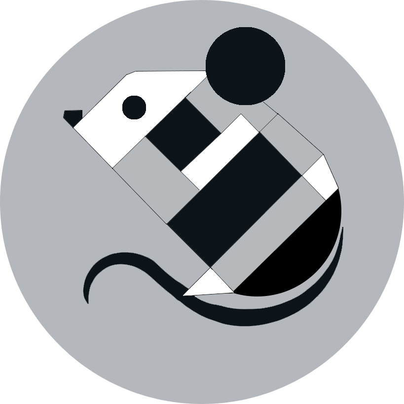

<p align="center">
  
</p>

# Mouse

A Python MVC Web Framework inspired by Laravel

## Tested Environnment

- Docker
    - Linux Mint 22
    - Windows 10
- On host
    - Windows 10

## Installation

```bash
pip install Mouse
```

## Cloning Procedure

- ```bash
    git clone https://github.com/Dolotboy/Mouse
    ```
- ```bash
    cd mouse
    ```
- Copy ".env.example"
- Paste
- Rename the copy for ".env"

## Dependencies

- [Python 3.12](https://www.python.org/downloads/)
- [Python DotEnv](https://pypi.org/project/python-dotenv/)
    - ```bash 
        pip install python-dotenv
        ```
